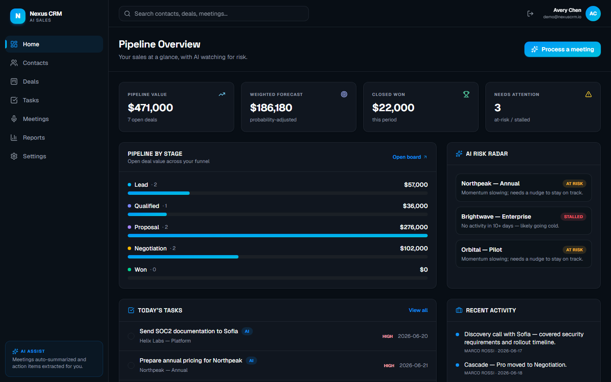
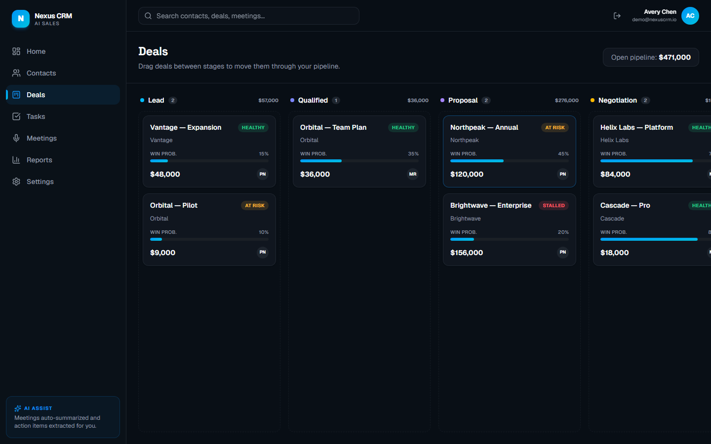
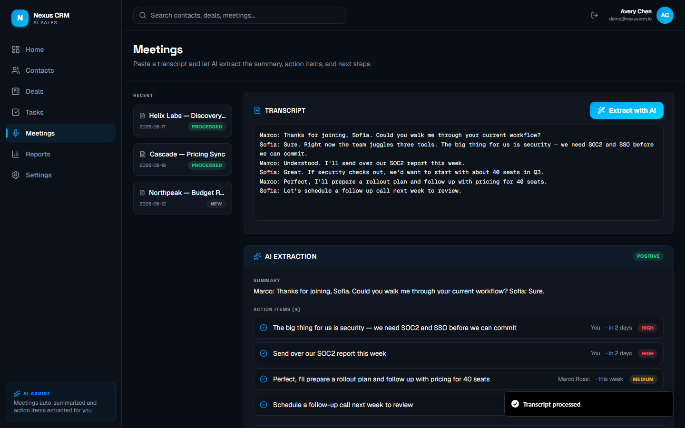
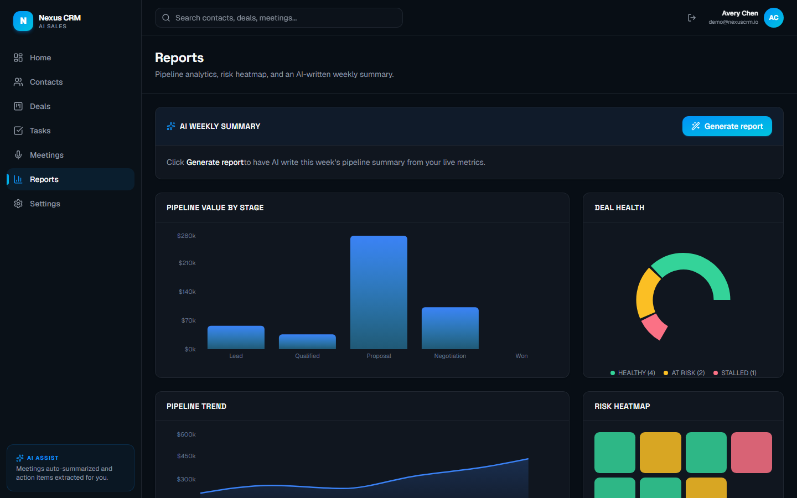
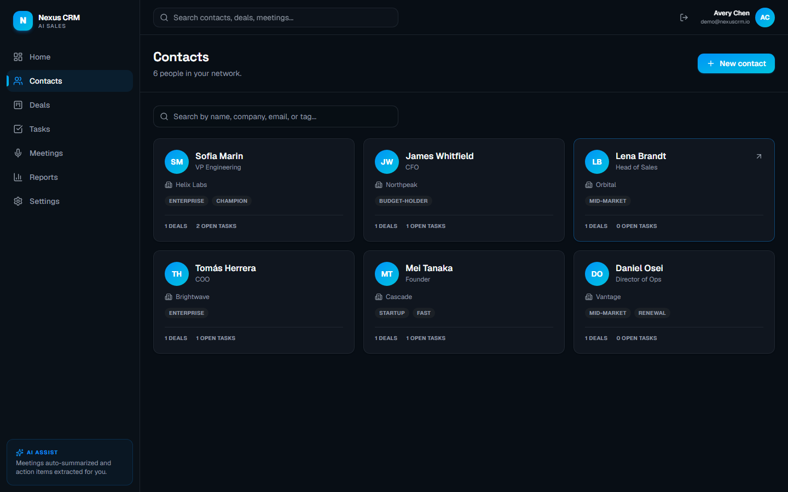
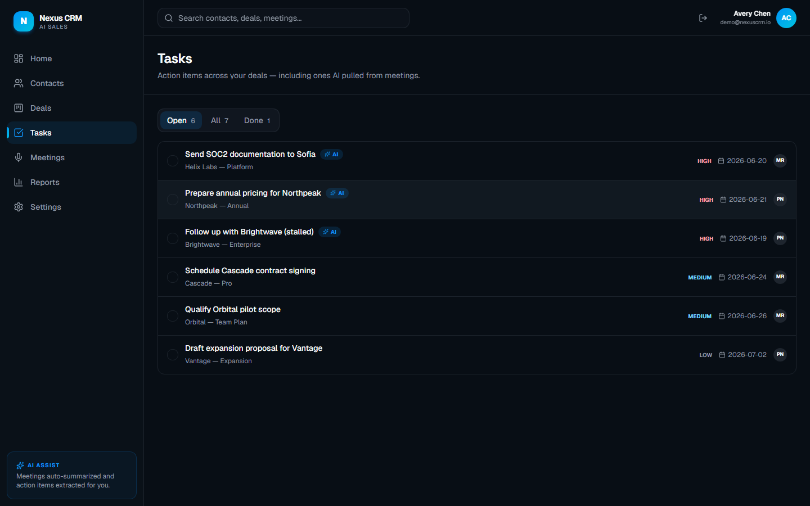
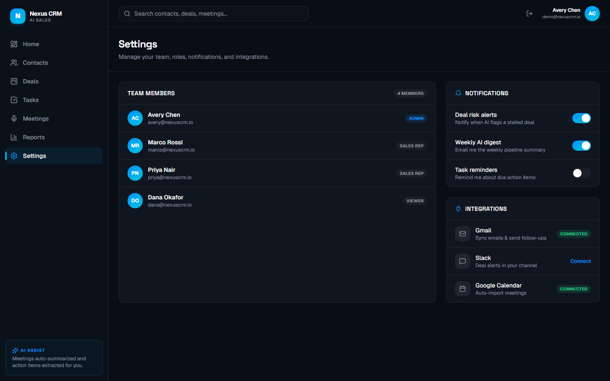
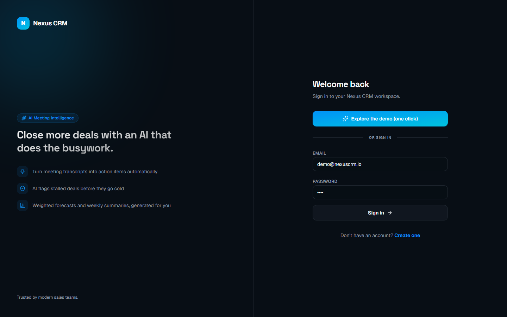

<div align="center">

# Nexus CRM

### AI-powered CRM with meeting intelligence

A full-stack CRM that turns meeting transcripts into action items, flags deal risk, and writes your weekly summary — built with **Next.js 16**, **React 19**, **TypeScript**, **Prisma**, and a pluggable AI layer.

<br />



<p>
  
  
  
  
  
  
</p>

</div>

---

## Overview

Nexus CRM is a sales workspace built around **AI meeting intelligence**. Paste a call transcript and the assistant extracts a summary, action items (with owners and due dates), sentiment, and a draft follow-up email. The pipeline watches itself — stalled and at-risk deals are surfaced automatically, and a weekly summary is written for you.

> **Try it instantly:** the app ships with a one-click **demo login** and rich seeded data, so you can explore the full product without any setup. Connect a Postgres database to switch from demo data to real persistence.

## ✨ Features

- **AI meeting intelligence** — transcript → summary + action items + sentiment + follow-up email draft
- **Deals Kanban** — drag-and-drop deals across pipeline stages
- **AI risk radar** — automatically flags stalled / at-risk deals
- **AI deal scoring** — probability-to-close with reasoning
- **AI weekly report** — narrative pipeline summary generated from live metrics
- **Contacts** — searchable directory with tags, notes, linked deals, and activity
- **Tasks** — action items (including AI-extracted ones) with priority, due dates, assignees
- **Reports** — pipeline-by-stage, deal-health donut, trend, and a risk heatmap
- **Settings** — team members with roles (Admin / Sales Rep / Viewer), notifications, integrations
- **Auth** — NextAuth credentials with route protection

## 🧠 The AI layer

The AI service ([`src/lib/ai.ts`](src/lib/ai.ts)) runs in **mock mode by default** — it returns realistic, deterministic results (with a light heuristic pass over transcripts) so the product is fully demoable at zero cost. To use real inference, set `AI_PROVIDER` and an API key; the function signatures stay identical:

```env
AI_PROVIDER="openai"   # or "anthropic"
OPENAI_API_KEY="..."
```

## 🛠 Tech Stack

| Layer | Technology |
|-------|------------|
| Framework | [Next.js 16](https://nextjs.org/) (App Router, Server Actions) |
| UI | [React 19](https://react.dev/), [TypeScript](https://www.typescriptlang.org/), [Tailwind CSS v4](https://tailwindcss.com/) |
| Drag & drop | [@dnd-kit](https://dndkit.com/) |
| Charts | [Recharts](https://recharts.org/) |
| Database | [PostgreSQL](https://www.postgresql.org/) + [Prisma 7](https://www.prisma.io/) (driver adapter) |
| Auth | [NextAuth.js](https://next-auth.js.org/) |
| AI | OpenAI / Anthropic (pluggable; mock by default) |

## 📸 Screenshots

| Deals Kanban | AI Meeting Extraction |
|---|---|
|  |  |

| Reports | Contacts |
|---|---|
|  |  |

<details>
<summary>More screenshots</summary>

### Tasks


### Settings


### Login


</details>

## 🏁 Getting Started

```bash
git clone https://github.com/killingspree001/ai-crm.git
cd ai-crm
npm install
cp .env.example .env   # fill in DATABASE_URL + NEXTAUTH_SECRET
```

### Run in demo mode (no database)
Leave `DATABASE_URL` as the placeholder and just run:
```bash
npm run dev
```
Open [http://localhost:3000](http://localhost:3000) and click **“Explore the demo.”**

### Run with a real database
Point `DATABASE_URL` at a Postgres instance (e.g. a free [Neon](https://neon.tech) database), then:
```bash
npm run db:push   # create tables
npm run db:seed   # seed demo data (login: demo@nexuscrm.io / demo)
npm run dev
```

## 📁 Project Structure

```
src/
├── app/
│   ├── (app)/         # protected app: home, contacts, deals, tasks, meetings, reports, settings
│   ├── (auth)/        # login & register
│   ├── api/           # auth & register routes
│   └── actions.ts     # server actions (CRUD + AI)
├── components/        # app shell, deals (Kanban), meetings, reports, contacts, ui/
└── lib/
    ├── ai.ts          # AI service (mock + real-provider stubs)
    ├── queries.ts     # data layer (Prisma, with demo fallback)
    ├── prisma.ts      # Prisma 7 client (pg driver adapter)
    └── demo-data.ts   # seed dataset for demo mode
prisma/
└── schema.prisma      # User, Contact, Deal, Task, Meeting, Activity, ...
```

## 📄 License

Released under the [MIT License](LICENSE).

---

<div align="center">
Built by <a href="https://github.com/killingspree001">killingspree001</a>
</div>
